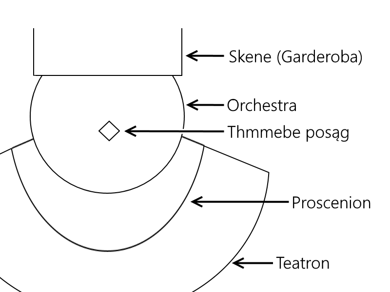

# Starożytność + Style Wypowiedzi

*Repetytorium nr 1 — „UKOCHANY JĘZYK POLSKI” (Sprawdzian nr 2)*

---

**Spis treści**

- [1. Style wypowiedzi](#1-style-wypowiedzi)
  - [1.1. Styl potoczny](#11-styl-potoczny)
  - [1.2. Styl naukowy](#12-styl-naukowy)
  - [1.3. Styl urzędowo-kancelaryjny](#13-styl-urzędowo-kancelaryjny)
  - [1.4. Styl artystyczny](#14-styl-artystyczny)
  - [1.5. Style retoryczny](#15-style-retoryczny)
  - [1.6. Styl publicystyczny](#16-styl-publicystyczny)
  - [1.7. Stylizacja](#17-stylizacja)
  - [1.8. Elementy aktu komunikacji Romana Jacobsona](#18-elementy-aktu-komunikacji-romana-jacobsona)
  - [1.9. Topos](#19-topos)
  - [1.10. Archetyp](#110-archetyp)
- [2. Esej jako forma gatunkowa](#2-esej-jako-forma-gatunkowa)
- [3. Prometeusz — bohater wieloznaczny (fragm. eseju Głowińskiego)](#3-prometeusz--bohater-wieloznaczny-fragm-eseju-głowińskiego)
  - [3.1. Sprzeczne role Prometeusza](#31-sprzeczne-role-prometeusza)
- [4. Ukaranie Prometeusza Karela Čapka jako przykład groteski](#4-ukaranie-prometeusza-karela-čapka-jako-przykład-groteski)
  - [4.1. Manipulacja językowa](#41-manipulacja-językowa)
  - [4.2. Oskarżony jest winny](#42-oskarżony-jest-winny)
  - [4.3. Groteska](#43-groteska)
- [5. Labirynt — metaforyczne sensy](#5-labirynt--metaforyczne-sensy)
  - [5.1. „Labirynt nad morzem” Herberta](#51-labirynt-nad-morzem-herberta)
    - [5.1.1. Kultura minojska](#511-kultura-minojska)
    - [5.1.2. Kultura malarstwa egipskiego](#512-kultura-malarstwa-egipskiego)
    - [5.1.3. Etymologia słowa «Labirynt»](#513-etymologia-słowa-labirynt)
    - [5.1.4. Odczucia Herberta w Heraklionie](#514-odczucia-herberta-w-heraklionie)
    - [5.1.5. Mit o Minotaurze](#515-mit-o-minotaurze)
    - [5.1.6. Koncepcje Platona](#516-koncepcje-platona)
    - [5.1.7. Koncepcje Wunderlicha](#517-koncepcje-wunderlicha)
  - [5.2. „Labirynt budowany w słowie” — analiza eseju Michała Głowińskiego](#52-labirynt-budowany-w-słowie--analiza-eseju-michała-głowińskiego)
  - [5.3. „Te korytarze” Czesława Miłosza](#53-te-korytarze-czesława-miłosza)
- [6. „Półmrok ludzkiego świata” — Eseje Zygmunta Kubiaka](#6-półmrok-ludzkiegoświata--eseje-zygmunta-kubiaka)
  - [6.1. Homer i Orfeusz](#61-homer-i-orfeusz)
  - [6.2. „Grecy już nie żyli […] w obrębie łaskawego marginesu historii”](#62-grecy-już-nie-żyli--w-obrębie-łaskawego-marginesu-historii)
  - [6.3. Porównanie **poezji do lampy w mroku**](#63-porównanie-poezji-do-lampy-w-mroku)
  - [6.4. Ślepota Homera](#64-ślepota-homera)
  - [6.5. Współczesny mit o Orfeuszu (archetyp artysty)](#65-współczesny-mit-o-orfeuszu-archetyp-artysty)
  - [6.6. Apollo i Marsjasz](#66-apollo-i-marsjasz)
- [7. Teatr w starożytnej Grecji](#7-teatr-w-starożytnej-grecji)
- [8. Struktura tragedii (wewnętrzna i zewnętrzna)](#8-struktura-tragedii-wewnętrzna-i-zewnętrzna)
  - [8.1. Etymologia](#81-etymologia)
  - [8.2. Promotorzy](#82-promotorzy)
- [9. „Król Edyp” jako przykład doskonałej tragedii](#9-król-edyp-jako-przykład-doskonałej-tragedii)
  - [9.1. Charakterystyka Edypa](#91-charakterystyka-edypa)
  - [9.2. Edyp kiedy ktoś mu się sprzeciwia (Tyrezjasz mu się sprzeciwia)](#92-edyp-kiedy-ktoś-mu-sięsprzeciwia-tyrezjasz-mu-sięsprzeciwia)
  - [9.3. Uniwersalna wymowa tragedii](#93-uniwersalna-wymowa-tragedii)
  - [9.4. Koncepcja losu ludzkiego](#94-koncepcja-losu-ludzkiego)
  - [9.5. Filozofia platońska, stoicka, egzystencjalna](#95-filozofia-platońska-stoicka-egzystencjalna)
- [10. Biblia](#10-biblia)
  - [10.1. Księga Hioba](#101-księga-hioba)
  - [10.2. Księga Koheleta](#102-księga-koheleta)
  - [10.3. Księga Psalmów](#103-księga-psalmów)
    - [10.3.1. Psalm — gatunek](#1031-psalm--gatunek)
    - [10.3.2. Psalm 1 (mądrościowy)](#1032-psalm-1-mądrościowy)
    - [10.3.3. Psalm 100 (dziękczynny, pochwalny)](#1033-psalm-100-dziękczynny-pochwalny)
    - [10.3.4. Psalm 130 (błagalny)](#1034-psalm-130-błagalny)
  - [10.4. Pieśń nad Pieśniami](#104-pieśń-nad-pieśniami)
  - [10.5. Hymn o miłości św. Pawła](#105-hymn-o-miłości-św-pawła)
  - [10.6. Apokalipsa św. Jana](#106-apokalipsa-św-jana)
  - [10.7. Przypowieści biblijne](#107-przypowieści-biblijne)
  - [10.8. Cechy stylu biblijnego](#108-cechy-stylu-biblijnego)
- [11. Uczta Platona](#11-uczta-platona)
- [12. „Wieża” Gustawa Herlinga Grudzińskiego (GHG)](#12-wieża-gustawa-herlinga-grudzińskiego-ghg)
  - [12.1. Rola inicjalnej części opowiadania](#121-rola-inicjalnej-części-opowiadania)
  - [12.2. Rola finalnej części opowiadania](#122-rola-finalnej-części-opowiadania)
  - [12.3. Losy bohaterów](#123-losy-bohaterów)
  - [12.4. Historia świętokrzyskiego pielgrzyma jako metafora ludzkiej egzystencji](#124-historia-świętokrzyskiego-pielgrzyma-jako-metafora-ludzkiej-egzystencji)
  - [12.5. Bezpośrednie i pośrednie odwołania do księgi Hioba](#125-bezpośrednie-i-pośrednie-odwołania-do-księgi-hioba)
  - [12.6. ROLA LITERATURY](#126-rola-literatury)
- [13. „Psalmów Psalm” Norwida](#13-psalmów-psalm-norwida)
- [14. Jeźdźcy — Kazik](#14-jeźdźcy--kazik)

---

## 1. Style wypowiedzi

### 1.1. Styl potoczny

1. Słownictwo\
    jest:

    - emocjonalne
    - ekspresyjne

    oraz zawiera:

    - neologizmy
    - wulgaryzmy, wyrazy potoczne
    - kolokwializmy
    - powtórzenia

2. Składnia:
   - nierozbudowana
   - swobodna
   - krótkie zdania
   - dużo równoważników zdań

3. Zastosowania:
   - wypowiedzi codzienne
   - listy prywatne, nieoficjalne
   - pamiętniki

**Funkcja: *ekspresywna***

---

### 1.2. Styl naukowy

1. Słownictwo:
   - specjalistyczne, terminologia naukowa
   - brak słów potocznych
   - brak ekspresjonizmów

2. Składnia:
   - dbałość o poprawność językową
   - rozbudowana składnia, zdania wielokrotnie złożone
   - ścisłość, logiczność
   - uporządkowany tok rozumowania, logika wywodu
   - brak środków stylistycznych

3. Kompozycja:
   - przypisy
   - cytaty
   - odwołania do źródeł

4. Zastosowania:
   - publikacje naukowe
   - wykłady książki

**Funkcja: *informatywna***

---

### 1.3. Styl urzędowo-kancelaryjny

1. Słownictwo:
   - formy grzecznościowe
   - utarte zwroty frazeologiczne
   - słownictwo interdyscyplinarne
   - oficjalne

2. Język, składnia:
   - schematyczna składnia
   - szablonowość
   - zdania pojedyncze, złożone
   - strona bierna
   - dążenie do jasności

3. Kompozycja:
   - uporządkowana
   - schematyczna

4. Zastosowania:
   - podania
   - pisma oficjalne, urzędowe
   - instrukcje obsługi

**Funkcja: *informatywna***

---

### 1.4. Styl artystyczny

1. Słownictwo
   - bogate
   - urozmaicone

2. Język, składnia:
   - mnogość środków stylistycznych
   - rozbudowana, urozmaicona składnia
   - zdania wielokrotnie złożone
   - dbałość o poprawność językową
   - zindywidualizowany

3. Zastosowania:
   - język poetycki
   - literatura piękna, odmiana j. literackiego
   - sztuka

**Funkcja: *poetycka***

---

### 1.5. Style retoryczny

1. Słownictwo:
   - formy apelatywne
   - wykrzyknienia
   - apostrofy

2. Język, składnia:
   - obrazowość (alegorie)
   - pytania retoryczne
   - rozbudowana składnia
   - sugestywność
   - perswazja
   - oddziaływanie na emocje odbiorcy

3. Kompozycja:
   - logika wywodu
   - powtórzenia

4. Zastosowania:
   - mowy
   - apele
   - przemówienia

**Funkcja: *impresywna***

---

### 1.6. Styl publicystyczny

1. Słownictwo:
   - interdyscyplinarne
   - ekspresjonizmy

2. Język, składnia:
   - dążenie do obiektywizmu
   - nakłonienie odbiorcy do swoich przekonań
   - dążenie do skrótowości
   - pomimo poprawności językowej rozluźnienie formy
   - elementy stylu potocznego
   - urozmaicona składnia zdań
   - proste środki stylistyczne

3. Zastosowania:
   - artykuły prasowe
   - felietony

*Funkcja zależna od tekstu*

---

### 1.7. Stylizacja
*— celowe wprowadzenie do tekstu cech innego stylu wyraźnie rozpoznawalnego jako cudzy.*

Funkcje:
- budowanie nastroju
- pogłębienie charakterystyki postaci poprzez pokazanie jej związków z określonym środowiskiem
- przedstawienie realiów dawnych epok życia konkretnego środowiska
- odwołanie się do tradycji literackiej, m. in. biblijnej, młodopolskiej itp.

---

### 1.8. Elementy aktu komunikacji Romana Jacobsona

Mamy 6 składników komunikacji:

$$
Nadawca
\xrightarrow
[\text{kontekst, kontakt}]
{\text{kod, komunikat}}
Odbiorca
$$

*lub inaczej*

$$
Nadawca
\xrightarrow
[\textit{sytuacja, więź}]
{\textit{język, treść}}
Odbiorca
$$

---

### 1.9. Topos
*— stale powtarzający się motyw w kulturze;* pojęcie wprowadzone przez Ernsta Curtiusa

### 1.10. Archetyp
*— pierwowzór, zbiór zachowań ludzkich przechowywanych w podświadomości kolektywnej;* pojęcie wprowadza Carl Gustav Jung

---

## 2. Esej jako forma gatunkowa

- subiektywizm, swobodna forma
- definicja eseju jest otwarta
- intertekstualność – odwołania do innych tekstów
  - erudycyjność
  - asocjacyjność
- intelektualizm
- indywidualizm
- nowatorskie ujęcie tematu

---

## 3. Prometeusz — bohater wieloznaczny (fragm. eseju Głowińskiego)

**Kim jesteś? $\equiv$ Co znaczysz?**

*Symbolika, ukryty sens, symboliczne sensy, interpretacje*

Chodzi o wielość interpretacji tego mitu, jego symboliki.

### 3.1. Sprzeczne role Prometeusza

Prometeusz jako bohater wieloznaczny, absurdalny, paradoksalny. Odgrywa wiele sprzecznych ze sobą ról:

| **+**                                        | **-**                                 |
| -------------------------------------------- | ------------------------------------- |
| dawca                                        | złodziej                              |
| daje biednym                                 | odbiera możnym                        |
| bóg (Terystaklion go porównuje do Chrystusa) | demon                                 |
| odkupiciel                                   | szatan                                |
| twórca, konstruktor świata                   | zburzył stary ład                     |
| stwórca człowieka                            | sprowadził na ziemię skrzynkę Pandory |
| dobroczyńca                                  | złoczyńca                             |
| bohater dla ludzi                            | buntownik wobec bogów                 |
| męczennik                                    |
| szlachetny                                   | zbójca                                |
| nauczyciel ludzkości                         |

**Był bogiem, ale cierpiał jak człowiek**

**Prometeusz jest bohaterem wieloznacznym, ponieważ odgrywa wiele ról, które są często ze sobą sprzeczne.**

---

## 4. Ukaranie Prometeusza Karela Čapka jako przykład groteski

### 4.1. Manipulacja językowa

- forma zamierzonego działania, którego celem jest wywieranie wpływu na osobę, lub grupę osób
- środki językowe
  - użycie 1os. liczby mnogiej
  - wywołanie wrażenia identyfikacji z czytelnikiem
  - eufemizmy
  - wyrazy wartościujące
  - zmiana semantyki (znaczenia)
  - sugerowanie odpowiedzi
  - wyolbrzymienie lub banalizowanie problemu
  - deprecjacja przeciwnika

Manipulacja językowa a perswazja:
- manipulacja językowe jest ukryta, perswazja jest jawna dla odbiorcy
- perswazja nie ma na celu zaszkodzić odbiorcy
- manipulacji chodzi o ukrycie prawdziwego celu nadawcy, perswazja to jawne przekonywanie odbiorcy

### 4.2. Oskarżony jest winny

Argumenty:
- jest zdrajcą
- sugeruje odpowiedź
- świętokradca
- złodziej
- deprecjacja
- próżniak
- nierób
- destruktor
- niszczyciel
- szkodnik
- zbrodniarz
- wywrotowiec (rewolucjonista)
- demoralizator
- zdrajca stanu
- buntownik
- sabotażysta

*Największa groteska:* **wielki, przełomowy wynalazek służy do przygotowania tak banalnego dania (pieczona baranina). Wielki ogień równa z solą i czosnkiem**

*Problematyka:* **sąd nad Prometeuszem, groteska służy temu, aby zdemaskować władzę totalitarną.**

### 4.3. Groteska
*— zestawienie zaprzeczeń, kategoria estetyczna, sposób mówienia o rzeczywistości za pomocą zestawienia sprzecznych elementów w celu ukazania prawdy;*

Cechy:
- kontrast
- hiperbola
- oksymoron
- paradoks

---

## 5. Labirynt — metaforyczne sensy

### 5.1. „Labirynt nad morzem” Herberta

Herbert stawia tezę, że **Grecy wiele zawdzięczają religi Minojczyków (Zeus i Demeter pochodzą stamtąd)**

> *Tytuł odsyła do metafory labiryntu, czyli budowli, w której centrum ukryty jest skarb, lecz trudno do niego trafić w ciągu korytarzy. Takim labiryntem był pałac Knossos, w którym, według mitu, zamknięty był Minotaur. Dla Herberta labiryntem w sensie metaforycznym jest poznawanie świata sztuki antycznej i konfrontowanie własnych wyobrażeń na jego temat z rzeczywistością. Zdaniem pisarza, nie należy przyjmować za własne cudzych sądów na temat jakiegoś dzieła sztuki, lecz należy świadomie samodzielnie oceniać. Dzieła antyczne są bardzo często tylko rekonstrukcją.*
>
> Źródło – [panoramaliteratury.pl](http://panoramaliteratury.pl/index.php?action=entry&what=94)

Według Herberta **metaforycznym sensem labiryntu jest poznawanie świata sztuki antycznej** (KRETA - odkrywanie Krety) **samemu, samodzielnie konfrontując własne wyobrażenia na jej temat z rzeczywistością. Nie należy przyjmować cudzych poglądów, tylko samodzielnie oceniać dzieła sztuki, ponieważ są one często tylko rekonstrukcją.**

- Labirynt piękna — podróż po muzeach, po wiedzy

- bardzo często przeżywa rozczarowanie

- szuka ładu moralnego, piękna, ucieka od chaosu XX wieku;

- zły zaułek labiryntu — rekonstrukcja dzieła antycznego

#### 5.1.1. Kultura minojska

- spontaniczna, nerwowa, porywcza, niedokładna (Minojczycy malowali na jeszcze mokrych ścianach)
- ukazująca wdzięk, uśmiech, gest taneczny
- brak wzniosłości (bez zadumy, religijnej ekstazy)
- idea przyrody (ptaki, ryby, kwiaty)
- ornamenty, motywy dekoracyjne, stylizowane rośliny

*zdecydowana, bez szczegółów, improwizująca, lekka i radosna*

**kultura minojska to pięknie ilustrowana książka bez tekstu**

#### 5.1.2. Kultura malarstwa egipskiego

- technika tempery (pozwalająca na retusz, poprawki)
- skupiona, powolna
- kontemplacyjna, metafizyczna
- bardzo dokładna, dokładność nie oznacza pochwały życia, ale melancholię przemijania

**szczegółowa, przemyślana, melancholijna, metafizyczna**

#### 5.1.3. Etymologia słowa «Labirynt»
— nazwa **pałacu Minosa**, pochodzi od słowa *«labrys»* (przedgrecki język pelazgjiski) oznaczający topór o podwójnym ostrzu; czyli **labirynt to pałac toporów o podwójnym ostrzu**

#### 5.1.4. Odczucia Herberta w Heraklionie
*opinie Herberta na temat Krety, kultury minojskiej, odkrycia Evansa*

Freski:
   - banalne kolory
   - linie bez napięcia, płaski kontur
   - brak głębi, powagi, wdzięku (z wyjątkiem fresków ogrodowych i „Paryżanki”)
   - łatwość chwytania kształtów jednym konturem
   - niesubstancjonalność (brak kośćca, mięsa, materii, struktury) ludzi, zwierząt i roślin bez korzeni

Opinie Herberta–
   1. na temat sposobu pracy Evansa: zauważa odtwarzanie fresków według własnej wizji odkrywcy
   2. o wyglądzie fresków:\
      są nieliczne, okaleczone zabiegami konserwatorów i jako takie wymagają naszego współczucia i zrozumienia
  3. o sztuce minojskiej:
     - mniej wielka niż egipska
     - oryginalność
     - ornamenty, dekoracje, architektura, kolumny, portyki etc.
     - wyszukana
     - dojrzała

#### 5.1.5. Mit o Minotaurze

- człowiek z głową byka narodził się ze związku Persefony z bykiem
- król Minos każe Dedalowi wybudować pałać, labirynt dla Minotaura
- co roku składano ofiarę 7 chłopców i 7 dziewcząt ateńskich
- Tezeusz (jeden z chłopców przeznaczonych na ofiarę) po przybyciu na Kretę zakochał się w Ariadnie, córce Minosa i dostał od niej nić, dzięki której, po zabiciu Minotaura, wydostał się z labiryntu
- **Tezeusz** jest w tym ujęciu bohaterem politycznym, wyzwolicielem swojego kraju spod obcego jarzma. Herbert ma dużą dozę sympatii wobec **Minotaura** (porównanie do kota Maciusia).

#### 5.1.6. Koncepcje Platona

Dzieła Platona, Timajos i Krytiasz to poematy o wszechświecie. Platon uważał, że Atlantyda znajdowała się na Oceanie atlantyckim, była kontynentem większym od Libii i Azji razem wziętych. Atlantyda została zatopiona w tym samym czasie co nastąpił upadek kultury minojskiej i wybuch wulkanu na wyspie Thera.

#### 5.1.7. Koncepcje Wunderlicha

> *Dokąd byk porwał Europę czyli o korzeniach kultury*\
> Wunderlich ~1972 r.

Knossos nie było siedzibą królów kreteńskich, ale pałacem zmarłych, ogromnym cmentarzyskiem, *nekropolią*.
- nietrwałość materiałów z jakich zbudowano Knossos (drewniane kolumny, cienkie ściany, gips, alabastrowe schody)
- małe pokoje bez okien sugerują, że były to krypty
- brak dostatecznej ilości budynków przeznaczonych na warsztaty, kuchnie czy stajnie potrzebne dla obsługi potężnego pałacu
- inna interpretacja przeznaczenia przedmiotów od interpretacji Evansa:
  - pitboi (pojemniki na oliwę wg Evansa) zawierały szczątki kości
  - wanny wg Evansa to wg Wunderlicha sarkofagi

**Herbert przy ocenie Evansa nazywa go TENNYSONEM archeologii**

### 5.2. „Labirynt budowany w słowie” — analiza eseju Michała Głowińskiego

Metaforyczny sens:
- poziom skomplikowania języka
- niemożność wyrażenia się, porozumienia się z drugim człowiekiem

Peryfraza Labiryntu: **swoiście ukształtowana przestrzeń**

**Labirynt budowany w słowie to wszystkie interpretacje mitu, wszystkie słowa wyjaśniające labirynt**

Charakterystyka nadawcy tekstu: badacz mitów, naukowiec, erudyta, utożsamia się z czytelnikiem (1os. liczby mnogiej)

### 5.3. „Te korytarze” Czesława Miłosza

- sytuacja liryczna: błądzenie w labiryncie życia
- życie to zdążanie do celu czyli do śmierci
- całe życie to żegnanie tych, którzy odchodzą
- mit labiryntu został wykorzystany po to, aby zobrazować ludzką egzystencję (dążenie do śmierci)

---

## 6. „Półmrok ludzkiego świata” — Eseje Zygmunta Kubiaka

### 6.1. Homer i Orfeusz

Homer:
- wojna
- postać autentyczna
- gra na formindze
- epika, pieśni heroiczne
- pieśniarz
- śpiewał dla ludzi
- chciał utrwalić dawną świetność
- świat, w którym żyje jest szary i prymitywny, bo świat
- opisywanych Achajów to świat bogactwa, siły i piękna
- rola pieśni Homera

Orfeusz:
- sielanka, miłość, przyroda
- postać mityczna
- gra na lirze
- pieśni liryczne
- śpiewak
- śpiewał dla przyrody

Obaj:
- artyści
- poeci
- pieśniarze

### 6.2. „Grecy już nie żyli […] w obrębie łaskawego marginesu historii”
- metafora, przenośnia
- łaskawym marginesem historii był czas bez wojen. Grecy żyli w późniejszym etapie, w którym powstała cywilizacja oraz było wiele wojen
- **margines łaskawy — czas pokoju**
- przenośnia ta oznacza, iż **historia to czas wojen przeplatany czasem pokoju**

### 6.3. Porównanie **poezji do lampy w mroku**
- poezja pozwala **odnaleźć piękno, nadzieję**
- pozwala wyznaczyć cel
- **dostrzec prawdę**
- Homer dzięki słowom, poezji, mógł niczym lampie w mroku, przedzierać się do tajemnicy świata i życia, do poznania prawdy

### 6.4. Ślepota Homera
- „Bogowie zabrali mu światło z oczu, ale za to dali mu pieśń”
- „Autor Iliady nie był ślepy. Ale żył w świecie ciemnym, szarym”
- żył w świecie ubogim w sztukę, gdzie ludzie nie dostrzegali echa poezji i kultury kreteńskiej, nie widzieli piękna

### 6.5. Współczesny mit o Orfeuszu (archetyp artysty)

*Józef Wittlin — „Orfeusz w piekle XX wieku”:*
- piekło XX wieku — wojna, obozy koncentracyjne
- dzisiejszy Orfeusz — artysta nie ma już tej mocy
- rola artysty — bezsilny, bezradny wobec zła, zagłuszony przez łoskot współczesnego świata
- dewaluacja pojęcia poeta
- zerwanie związku pomiędzy słowem i muzyką
- bezradność artysty wobec okrucieństw świata
- sztuka nie jest w stanie uratować człowieka (mityczny Orfeusz potrafił ugłaskać dzikie bestie)
- współczesny Orfeusz nie potrafi poskromić bestii w ludzkim sercu
- dawny Orfeusz pokonywał dźwięki przyrody, współczesny Orfeusz musi krzyczeć, żeby być usłyszanym (chaos współczesnego świata)

*Aleksander Wat — „Wiersz ostatni”*
- p. lir. opisuje zejście do metra
- przywołuje topos katabasy
- ludzkie życie to dążenie w dół do śmierci
- anafora - powtórzenie „schodzenie”
- ucieczka od chaosu

### 6.6. Apollo i Marsjasz

- p. lir. - obserwator
- Apollo:
  - gra na lirze (liryka)
  - reprezentuje klasycyzm (brak uczuć, doskonałość)
  - dumny, bo jest bogiem, Marsjasz zagraża pozycji Apollowi
  - bezduszny
  - niewrażliwy
  - obojętny, niewzruszony
  - doskonały, opanowany
  - bóg "nerwy z tworzywa sztucznego"

- Marsjasz:
  - gra na flecie
  - reprezentuje awangardę (szczerość, autentyczność, pełen
  - emocji)
  - pyszny, bo myśli, że potrafi dobrze grać na flecie
  - pokazuje ból i cierpienie
  - ekspresywny
  - szuka ukojenia

**problematyką utworu jest zobrazowanie różnych postaw wobec życia, refleksja na temat sztuki**

---

## 7. Teatr w starożytnej Grecji

- Dytyramby — hymn na cześć Dionizosa\
  –geneza, pochodzenie tragedii (duże dionizje w dużych miastach) i komedii (małe dionizje w małych wioskach)
- chór — komentuje, wyraża opinie, informuje o przeszłych i przyszłych zdarzeniach
- zasada Decorum:
  - jedność stylu i treści
  - brak scen krwawych i zbiorowych
  - brak elementów fantastycznych
- zasada trzech jedności
  - jeden główny wątek
  - w ciągu doby
  - w tym samym miejscu

## 8. Struktura tragedii (wewnętrzna i zewnętrzna)

### 8.1. Etymologia

trago $=$ kozioł $\land$ ode $=$ pieśń $\implies$ **tragedia $=$ pieśń kozła**

### 8.2. Promotorzy

- Tespis — tragik, aktor, twórca pierwszych tragedii
- greckich, w których występuje jeden aktor
- Ajschylos — wprowadza drugiego aktora
- Sofokles — wprowadza trzeciego aktora
- Eurypides — wprowadza żeńskie postaci
- Arystoteles — „Poetyka” — wszystkie prawidła dotyczące doskonałej tragedii:
  - zewnętrzne elementy struktury tragedii
    - prolog — wprowadzenie
    - parodos — wejście chóru, śpiew chóru
    - epeisodiony — partie dialogów

    - stasimony — pieśń i komentarze chóru // na przemian
    - exodus — pieśń chóru schodzącego ze sceny, koniec tragedii

  - wewnętrzne elementy
    - tragedia to sztuka mimetyczna (naśladowcza)
    - musi budzić litość i trwogę
    - nieszczęście człowieka niewinnego budzi litość
    - trwogę wzbudza nieszczęście człowieka podobnego do nas // nas też może to spotkać
    - konflikt tragiczny - konieczność wyboru między 2 słusznymi, ale wykluczającymi się wyborami
    - wina tragiczna - wina spowodowana nieświadomością popełnienia złego czynu; zbłądzenie, **HAMARTIA**
    - ironia tragiczna - nieświadome działanie zmierzające do katastrofy bohatera
    - katastrofa - nieuchronna klęska bohatera
    - tragizm - kategoria estetyczna, uwikłanie bohatera w konflikt sprzecznych racji
    - katharsis - oczyszczenie z uczucia litości, trwogi (na końcu przedstawienia)

## 9. „Król Edyp” jako przykład doskonałej tragedii

### 9.1. Charakterystyka Edypa
- współczujący, "O biedna dziatwo"
- litościwy
- troskliwy
- opiekuńczy
- martwi się o poddanych
- poczuwa się do odpowiedzialności
- dobro ludu ceni bardziej niż własne życie
- identyfikuje się z ludem
- empatyczny, cierpi razem z Tebańczykami

### 9.2. Edyp kiedy ktoś mu się sprzeciwia (Tyrezjasz mu się sprzeciwia)
- wybucha gniewem
- nie znosi sprzeciwu
- pyszny, obraża Bogów (obrażając Tyrezjasza)
- pycha go oślepia
- mimo, że widział, nie mógł dostrzec prawdy, więc się oślepił

### 9.3. Uniwersalna wymowa tragedii

**los Edypa $=$ egzemplum ludzkiego losu**

- szczęście — senne urojenie, człowiek nie ma prawa do szczęścia, żaden człowiek nie może być szczęśliwy
- życie — cień cienia, jest ulotne, efemeryczne, marne, przemija
- jeśli ktoś dozna szczęścia to tylko po to by mocniej odczuć swój upadek

### 9.4. Koncepcja losu ludzkiego

- człowiek jest zniewolony, jego los zależy od woli bogów, życie zdeterminowane przez **fatum**
- człowiek bezradny wobec przepowiedni
- jesteśmy zniewoleni, wszystko zależy od siły wyższej
- **człowiek nie ma wpływu na swój los**

### 9.5. Filozofia platońska, stoicka, egzystencjalna

- Człowiek jest marionetką w teatrze świata. // topos Theatrum Mundi
- To co widzimy to tylko odbicia prawdziwych bytów niedostępnych dla zmysłów człowieka
- Prawdziwy świat jest idealny - do którego należy dążyć
- Dusza — element najwyższej wartości poznawczej
- Stoicyzm — opanowanie emocji, chęci przyjemności jest podstawą do osiągnięcia szczęścia; najważniejsze jest życie zgodne z rozumem; życie należy przyjmować jakim jest niezależnie od sytuacji należy zachować stoicki spokój (wewnętrzny ład, równowagę emocjonalną) w życiu należy się kierować stoicką cnotą, nie pożądać więcej niż jest potrzebne, nie należy bać się śmierci, gdyż jest ona wpisana w ludzkie życie; nadmiar $=$ źródło niepotrzebnych rządz

**// rozum, cnota, umiarkowanie**

## 10. Biblia

### 10.1. Księga Hioba

Hiob:
- bogobojny
- bogaty
- sprawiedliwy
- autorytet

// zakład między Bogiem a szatanem (doświadczenie)

- Dlaczego ludzie cierpią niezawinieni?
- utwierdzenie w wierze
- sprawdzian człowieczeństwa
- poznanie czym jest szczęście

*„Pan dał, pan wziął”, „Nago wyszedłem z żywota matki mojej i nago się teraz wrócę”*

### 10.2. Księga Koheleta

- **VANITAS VANITATUM ET OMNIA VANITAS**
- **księga mądrościowa**
- rozważania autor na temat wartości ludzkiej egzystencji
- dochodzi on do wniosku, że wszystkie uciechy ziemskie są bezwartościowe
- **traktat filozoficzny**
- **przemijanie - motyw wanitatywny**

**// optymistyczna wymowa - trzeba się cieszyć życiem, które przemija, czerpać z życia póki się da**

### 10.3. Księga Psalmów

#### 10.3.1. Psalm — gatunek

- utwór liryczny, modlitewny
- ton patetyczny, podniosły
- przeznaczony do śpiewania

rodzaje psalmów:
- pochwalny
- dziękczynny
- błagalny
- mądrościowy
- pokutny
- proroczy

#### 10.3.2. Psalm 1 (mądrościowy)

- Temat dwóch dróg życia:
  - sprawiedliwych
    - życie zgodne z zasadami moralnymi wynikającymi z Prawa Mojżeszowego
    - droga radości
    - dostatniego życia $\rightarrow$ alegoria drzewa rosnącego przy wodzie
  - grzeszników
    - grzesznicy to plewy, które wiatr roznosi
    - motyw sądu, na którym Pan nagrodzi sprawiedliwych a występnych ukarze
- Nawiązanie do Hioba, relacje między Bogiem a Hiobem - pokora i poddanie się doprowadziło do szczęśliwego życia

#### 10.3.3. Psalm 100 (dziękczynny, pochwalny)

- p. lir. człowiek w imieniu ludu
- adresat liryczny: lud
- wzywanie do chwalenia Boga i dziękowanie za stworzenie
- człowiek przeżywa wiarę radośnie
- p. lir. ufa Bogu, całkowicie Mu się oddaje
- darzy Boga zaufaniem

#### 10.3.4. Psalm 130 (błagalny)

- p. lir. wierny (jednostka)
- adres. lir. Bóg
- modlitwa do Pana, żeby wysłuchał go i mu wybaczył oraz odkupił Izrael z grzechów
- obraz Boga:
  - dobroczynny
  - stwórca, sędzia
  - udziela przebaczenia
  - sprawiedliwy
  - wyczekiwany
  - miłosierny
  - niedostępny
  - surowy sędzia

### 10.4. Pieśń nad Pieśniami

- **Topos miłości**
- **Oblubieniec i Oblubienica**
  - kochają się i swoją fizyczność zestawiają z przyrodą
- tło - przyroda, tworzywa porównań (zęby jak trzody owiec, oczy twe gołębie; głowa to złoto najlepsze, zęby białe jak mleko)
- Poemat w warstwie dosłownej odczytywany jest jako zmysłowa liryka miłosna
- w interpretacji alegorycznej oblubieniec to Bóg, a oblubienica to wspólnota ludzi

### 10.5. Hymn o miłości św. Pawła

- człowiek mimo jakichkolwiek dokonań byłyby niczym bez miłości, nawet gdyby:
  - mówił wszystkimi językami ludzkimi i anielskimi
  - rozdał majątek swój cały
  - posiadł całą wiedzę
  - został męczennikiem
- Miłość jest najważniejsza: „A teraz trwają wiara, nadzieja i miłość - te trzy: lecz z nich większa miłość”
- **miłość nadaje ludzkiemu życiu sens**
- prawdziwa miłość jest:
  - cierpliwa
  - łaskawa
  - pozbawiona zazdrości
  - nie ma w niej pychy, egoizmu i gniewu
  - nigdy się nie kończy

### 10.6. Apokalipsa św. Jana

- księga profetyczna, ostatnia w Biblii
- opisuje koniec świata i sąd ostateczny
- narrator pierwszoosobowy
- odsłania sens dziejów
- apokaliptyczna wizja — przerażająca, tragiczna, zatrważająca (chaos, zniszczenie, cierpienie)
- symbolika
  - Alfa i Omega — początek i koniec // symbol Chrystusa
  - Baranek — Chrystus
  - Bestia — szatan
  - kobieta odziana w Słońce - Maryja
  - Babilon — miasto zła
  - Nowe Jeruzalem — miasto zstępujące z nieba, otwarte dla zbawionych
  - liczby:
    - 4 liczba ziemska
    - 7 liczba święta
    - 3 symbolizuje pełnię
  - barwy:
    - czerwień — ogień, krew, zniszczenie
    - czerń — zło, strach, niebezpieczeństwo
    - biel — śmierć
- istotne przesłanie tej księgi — po kataklizmie wyłania się nowy świat (Nowe Jeruzalem)
- Jeźdźcy:

    | Koń | Atrybut                | Dar           |
    | --- | ---------------------- | ------------- | --------------------------------- |
    | 1   | biały                  | łuk, wieniec  | wieniec zwycięstwa — miłość       |
    | 2   | czerwony (barwy ognia) | wielki miecz  | odebranie ziemi pokoju — wojna    |
    | 3   | czarny                 | waga          | głód                              |
    | 4   | trupioblady            | *\[otchłań\]* | śmierć ma charakter pesymistyczny |

### 10.7. Przypowieści biblijne

- utwór narracyjny zawierający opowieść zmyśloną acz prawdopodobną oraz jej metaforyczny sens
- inaczej: **parabola** - ważniejsze odczytanie warstwy ukrytej niż sama treść
- charakter uniwersalny (czas, miejsce, stypizowani bohaterowie)
- ilustracja ogólnych prawd filozoficznych, moralnych, religijnych
- cel: ukazanie drogi do Królestwa Niebieskiego

- Przypowieść o Siewcy
  - ziarno = nauka, słowo
  - sianie = głoszenie słowa Bożego
  - ziarno pada na drogę, skały, ciernie i żyzną glebę (metafory słuchaczy)

- Przypowieść o chwaście
  - siewca = Jezus
  - ziarno = dobro
  - nieprzyjaciel = diabeł, szatan
  - chwasty = synowie szatana
  - żniwa = sąd ostateczny
  - spalenie = piekło
  - spichlerz = niebo
  - żniwiarze = aniołowie

- Przypowieść o dobrej i złej budowli
  - dobra stoi na skale
  - zła na piasku	// systemy aksjologiczne
  - wiatr i burza = próba, sprawdzian

- Przypowieść o synu marnotrawnym

### 10.8. Cechy stylu biblijnego

- hieratyczność, patos
- szyk przestawny
- powtarzające się schematy wprowadzające „Mówi”, „Rzecze”, paralelizmy skł.
- obrazowość, alegorie
- archaizmy
- zdania współrzędne
- werset biblijny jest to cała myśl, a nie tylko jedna linijka
- spójniki „i”, „a”, „oraz”
- zaimki dzierżawcze „mój”, „twój”, „jego”

## 11. Uczta Platona

1. **KONCEPCJA MIŁOŚCI, TOPOS MIŁOŚCI **
- platońska idea przedstawiona przez Sokratesa, bohatera "Uczty" Platona
- nie wystarczy kochać ciało (miłość zmysłowa), bo szybko się nudzą, trzeba dążyć do miłości nadzmysłowej

2. **MIŁOŚĆ PLATONICZNA** - **NADZMYSŁOWA** (jest **siłą twórczą**)

## 12. „Wieża” Gustawa Herlinga Grudzińskiego (GHG)

### 12.1. Rola inicjalnej części opowiadania

- zapowiedź treści, problematyki
- wprowadza nastrój opuszczenia, osamotnienia

### 12.2. Rola finalnej części opowiadania

- podsumowanie problematyki
- GHG w ostatnim rozdziale wyznaje, że nie potrafi i nie chce napisać opowieści o mieszkańcu wieży; wielokrotnie lecz bezskutecznie próbuje dokończyć swoje dzieło - cierpienie to tajemnica
- mówi o roli literatury w życiu człowieka: **LITERATURA DAJE NADZIEJĘ**
- „Kiedy wpadniecie panie w sidła bólu i zgryzoty pomyślcie o samotniku z miasta Aosta. Wasza wizyta nie okaże się wówczas nadaremna”

### 12.3. Losy bohaterów

1. Osierocony Lebbroso zamieszkuje wieżę ogrodzoną murkiem.
2. Później zamieszkuje razem z siostrą, przybłąkuje się też pies Miracollo.
3. Śmierć siostry, zabicie psa przez mieszkańców Aosty
4. punkt zapalny - zauważenie pary kochanków - próba samobójcza Lebbrosa, odnalezienie listu, biblii i księgi Hioba
5. De Maistre pojawia się w Aoście jako oficer
6. śmieć trędowatego Pier Bernardo Guasco
7. Utrata rodziny nauczyciela przez trzęsienie ziemi
8. zakup domku w Aoście
9. śmierć Nauczyciela

|                   | Lebbroso                 | Nauczyciel          |
| ----------------- | ------------------------ | ------------------- |
| powód separacji   | choroba                  | śmierć najbliższych |
| samotność:        | **z konieczności**       | **z wyboru**        |
| stosunek do ludzi | **pragnie kontaktu**     | **stroni od nich**  |
| stos. do Boga     | pokorny                  | nie potrzebuje go   |
| stos. do śmierci  | **pogodzony z śmiercią** | **boi się śmierci** |
| rodzaj choroby    | **chore ciało**          | **chora dusza**     |

### 12.4. Historia świętokrzyskiego pielgrzyma jako metafora ludzkiej egzystencji

- góra, święty Krzyż - cel // sfera sacrum
- pozycja figury - klęcząca // pokora
- przesuwa się co roku o ziarnko maku // cierpliwość
- brak twarzy // każdy może się z nim utożsamić
- mała, zniekształcona głowa // ból, cierpienie
- dwa oczodoły niby dwa ciemne otwory // idzie po omacku, na oślep
- nienaturalnie opuszczone ramiona // rezygnacja, obciążenie, zmęczenie
- splecione ręce // nabożeństwo, pokora, pobożność, modlitwa
- wyżarty przez wiatry i deszcze // ból, cierpienie
- mijają go obojętni przechodnie // bezgraniczna samotność
- obrasta murawą // cierpliwość, próba oderwania się od sfery profanum do sacrum

### 12.5. Bezpośrednie i pośrednie odwołania do księgi Hioba

- Lebbroso czyta księgę Hioba, żeby podnieść się na duchu; [dała mu nadzieję, odnalazł w k. Hioba nadzieję i wytłumaczenie własnego losu]
- rzeźba na kapitelu jednej z kolumn krużganku romańskiego w klasztorze wyobrażała 3 fazy plag cielesnych Hioba
- Lebbroso cierpiał z powodu swojej choroby tak jak Hiob podczas plag
- tak samo jak Hiob, nauczyciel stracił swoją rodzinę
- pielgrzym świętokrzyski mimo przeciwności losu dalej szedł przez życie tak jak Hiob po utracie wszystkiego

### 12.6. ROLA LITERATURY
— **DAWANIE NADZIEI**

---

## 13. „Psalmów Psalm” Norwida

- W wierszu Norwida można odnaleźć odwołania do Hymnu św. Pawła
- Poeta przywołuje te same argumenty i te same cechy miłości
- Przekazuje tą samą prawdę o miłości

## 14. Jeźdźcy — Kazik

- Intertekstualne odwołania do Jeźdźców Apokalipsy
- Kult jeźdźcy
- Wskazanie jeźdźcy, który niesie śmierć jako ostatniego wzmacnia wymowę pesymistyczną, natomiast poprzez ustawienie jeźdźca miłości na końcu (u Kazika), sprawia, iż wymowa nabiera wartości optymistycznej, ponieważ jeździec, który niesie miłość daje **nadzieję**.

Dary jeźdźców:
- głód
- wojna jest tylko śmierć, brak nadziei
- śmierć
- słońce, miłość
